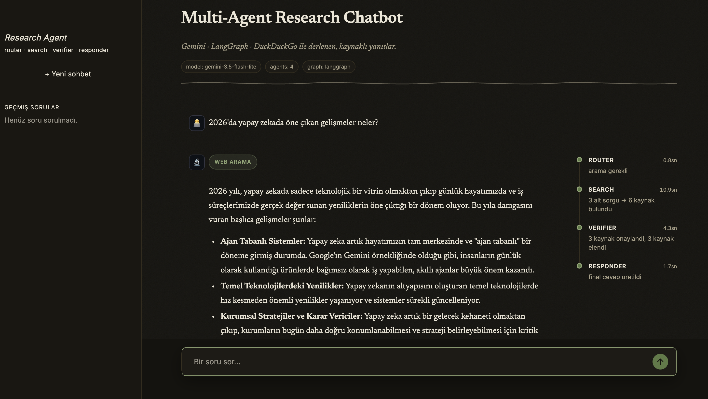
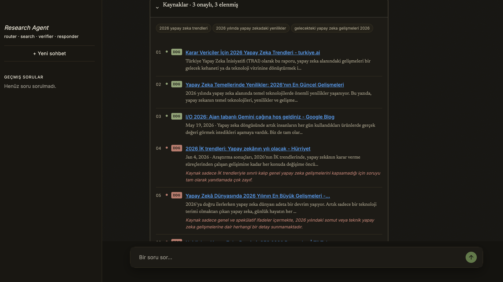
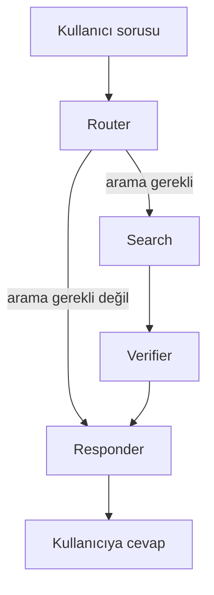

# Multi-Agent Research Chatbot

Kullanıcının sorusunu **Router → Search → Verifier → Responder** olmak üzere 4 agent'tan oluşan bir [LangGraph](https://github.com/langchain-ai/langgraph) akışında işleyip, gerektiğinde web'den kaynak toplayıp doğrulayarak kaynakçalı bir cevap üreten bir araştırma chatbot'u.




## Nasıl çalışıyor



| Agent | Görev |
|---|---|
| **Router** | Soruya bakıp güncel bilgi/arama gerektirip gerektirmediğine karar verir. |
| **Search** | Soruyu 2-3 alt sorguya böler, her biri için DuckDuckGo'da arama yapar. |
| **Verifier** | Bulunan her kaynağı tek tek değerlendirip alakasız/güvenilmez olanları eler, elenme sebebini kaydeder. |
| **Responder** | Onaylanan kaynaklara dayanarak (ya da arama gerekmiyorsa doğrudan) sohbet diliyle cevap yazar. |

Tüm agent'lar ortak bir `AgentState` (bkz. [agents/state.py](agents/state.py)) üzerinden okuyup yazıyor; hangi agent'ın ne yaptığı `trace` alanında loglanıyor ve arayüzde canlı olarak (her aşamanın ölçülen gerçek süresiyle) gösteriliyor.

## Teknolojiler

- **[Gemini](https://ai.google.dev/)** (`gemini-3.5-flash-lite`) — LLM, ücretsiz tier
- **[LangGraph](https://github.com/langchain-ai/langgraph)** — agent'ları koşullu yönlendirmeli bir state machine olarak birbirine bağlıyor
- **[ddgs](https://pypi.org/project/ddgs/)** — DuckDuckGo üzerinden ücretsiz web araması
- **[Streamlit](https://streamlit.io/)** — arayüz

## Kurulum

```bash
git clone https://github.com/beriloztan/multi-agent-research-chatbot.git
cd multi-agent-research-chatbot

python3 -m venv venv
source venv/bin/activate        # Windows: venv\Scripts\activate

pip install -r requirements.txt

cp .env.example .env            # sonra .env içine kendi GOOGLE_API_KEY'ini yaz
```

[Google AI Studio](https://aistudio.google.com/apikey)'dan ücretsiz bir Gemini API key alabilirsin.

## Çalıştırma

```bash
streamlit run app.py
```

## Proje yapısı

```
├── app.py                  # Streamlit arayüzü
├── requirements.txt
├── .env.example             # gerekli ortam değişkeninin şablonu
└── agents/
    ├── state.py             # ortak veri yapısı (AgentState)
    ├── tools.py             # web_search() — DuckDuckGo arama fonksiyonu
    ├── router.py             # Router Agent
    ├── search_agent.py       # Search Agent
    ├── verifier.py            # Verifier Agent
    ├── responder.py           # Responder Agent
    └── graph.py                # hepsini LangGraph ile birleştiren akış
```

## Sorun giderme / karşılaşılan sorunlar

Geliştirme sürecinde çıkan ve çözülen bazı sorunlar:

- **Gemini model isimlerinin sık değişmesi** — model adı zaman zaman değişebiliyor (`gemini-2.0-flash` → `gemini-2.5-flash` → `gemini-3.5-flash-lite` gibi). Hata alırsan [ai.google.dev](https://ai.google.dev/gemini-api/docs/models) üzerinden güncel model adını kontrol et ve `agents/*.py` içindeki `model=` parametrelerini güncelle.
- **Ücretsiz tier günlük kota limiti** — Gemini'nin ücretsiz kotası günlük istek sınırlı. Kota dolarsa bir süre bekleyip tekrar denemek gerekiyor.
- **DuckDuckGo rate-limit** — `ddgs` kütüphanesinin ücretsiz arama backend'i art arda gelen isteklerde bazen `No results found` hatası veriyor. `agents/tools.py` bu hatayı yakalayıp boş sonuç döndürüyor, `agents/search_agent.py` da sorgular arasına küçük bir bekleme koyup bir sorgunun başarısız olması durumunda diğerleriyle devam ediyor.
- **macOS'ta bağlantı takılması** — bazı ağlarda IPv6 kaynaklı bağlantı sorunları yaşanabiliyor; `networksetup -setv6off Wi-Fi` ile IPv6'yı kapatmak çözüm olabiliyor.
- **Gemini SDK'sının cevap formatı** — `response.content` bazen düz string yerine liste olarak dönebiliyor; bu yüzden her agent'ta cevabı güvenli şekilde ayrıştıran küçük bir yardımcı mantık kullanılıyor.

## Bilinen sınırlamalar

- Sohbet geçmişi yalnızca oturum boyunca (tarayıcı sekmesi açıkken) hafızada tutulur, kalıcı değildir.
- Her soru bağımsız işlenir; önceki mesajlara referans veren takip sorularında (örn. "peki ya İzmir?") bağlam korunmaz.
